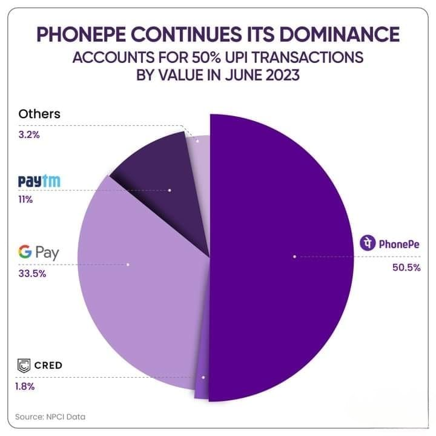

# *Fintech Case Study*

## Overview,Origin and Business Activities 
The  company I will be studying in an Indian Fintech company called  **Phone Pe**, which is a digital payments and financial services company.The **Phone Pe** app is available in 11 languages and can be used to send and receive money, recharge mobile,DTH ,data cards,make utility payments, pay at shops, buy insurance, invest in digital gold and mutual funds. It was incorporated in December 2015 by Sameer Nigam, Rahul Chari and Burzin Engineer and is headquartered in Banglore, India. It's parent company is Walmart.The **Phone Pe** app is based on the UPI(United payments Interface), which is an initiative by the Indian Government .**Phone Pe** has emerged as the biggest player in this sector. It has 480 million users and over the years it has made 6 acquisitions

---
## Technology  innovation in this sector and its impact
The Unified Payments Interface(UPI) is an instant payment system develeoped by Natioinal Payments Corporation of India(NPCI). It facilitates P2P and P2M transactions.You only need to register your mobile number with the bank, then the UPI ID of the recepient can be used to transfer money.  UPI has revolutionised the payment system in India and has shared it's UPI technlogy France, Australia, Singapore, Saudi Arabia and many more countries. **Phone Pe** is Unified Payments Interface(UPI) based  platform that allows you to link bank accounts securely to your smartphone using encrypted software(UPI ID) and transfer oney from your bank account to anyone without sharing any details. It uses 29 technology products including ML5 , jQuery , and Google Analytics.
This has had a great impact in India, with people being able to transfer money instantly at zero cost and without requiring to share the account number or the IFSC code. This has resulted into the inclusion of large number of people into the financial system, since every bank in India is required to have UPI enabled apps. It's convenience, security and cost effectiveness has appealed to everyone, to the effect that even street vendors have started accepting payments using **Phone Pe** or similar UPI based platforms. It has also made transferring subsidies or payments from government to the remote areas easier and more effective, as the money can directly be transferred to the right persin, without any physical involvement of a third party.

# Competitors
---
Some of the players in this field are  **Phone Pe**  **Paytm**  **Google Pay**, **Amazon Pay**, **CRED** but the major competitors to **Phone Pe** are   **Paytm** and **Google Pay**. **Paytm** has the largest revenue of any  payments company in India, wit it being almost $1 billion. **Paytm's** Q4 revenue of $281 million alone was greater the **PhonePe's** revenue of $230 million for the first 9 months of 2022.Inspite of this **Phone Pe** boasts of largest market share in this sector.  As of June 2023 the marketshare is as shown with the above 3 accounting for almost 94% market share.

# Recommendations
---
**Phone Pe**  is such a big company in its sector that the Government of India had asked them to curb their marketing activities in an effort to avoid creating a monopoly. With an already existing gigantic customer base, the company should consider diversifying into ONDC based shopping, stockbroking and lending.I believe that **Phone Pe** won't face any technological challenges in their efforts to expand in these sectors, as the technology is already available i.e it  does not require any innovation, and secondly because there is an ample supply of technology workforce  available  in India.

*Sources*
---
1. [Phone Pe Wikipedea](https://en.wikipedia.org/wiki/PhonePe)
2. [UPI Wikipedia](https://en.wikipedia.org/wiki/Unified_Payments_Interface)    
3. [Deccan Herald](https://www.deccanherald.com/business/paytm-beats-phonepe-google-pay-as-indias-highest-revenue-earner-in-mobile-payments-financial-services-1217481.html)
4. [Crunchbase](https://www.crunchbase.com/organization/phonepe)